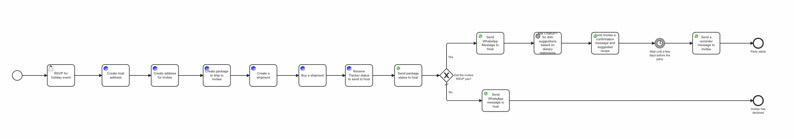

# 2023 Holiday Party Planner

The 2023 holiday season has started, and with that comes many activities and events. Planning a party and making sure the logistics behind inviting friends and family, as well as sending them gifts can become a nightmare. This project simplifies those tasks by using some newer Camunda Connectors to automate the holidays!

## The Model
This model has two main parts: sending a package to the invitee and sending out reminders for the party.

The first part of this model utilizes the [EasyPost connector](https://docs.camunda.io/docs/components/connectors/out-of-the-box-connectors/easy-post/). It walks through all the steps to send packages, including [creating addresses](https://docs.camunda.io/docs/components/connectors/out-of-the-box-connectors/easy-post/#create-address) for the host and invitee, [creating](https://docs.camunda.io/docs/components/connectors/out-of-the-box-connectors/easy-post/#create-a-shipment)and [buying](https://docs.camunda.io/docs/components/connectors/out-of-the-box-connectors/easy-post/#buy-a-shipment) the shipment, and [getting a tracker status](https://docs.camunda.io/docs/components/connectors/out-of-the-box-connectors/easy-post/#retrieve-a-tracker-by-id) for the host. The second part of the model uses the [WhatsApp Connector](https://docs.camunda.io/docs/components/connectors/out-of-the-box-connectors/whatsapp/) and the [OpenAI Connector](https://docs.camunda.io/docs/components/connectors/out-of-the-box-connectors/openai/). The WhatsApp Connector is used to send a tracker status to the host, a confirmation message to the invitee and host, and a reminder message before the party starts. The OpenAI connector utilizes ChatGPT to create a suggested recipe for the invitee. 
